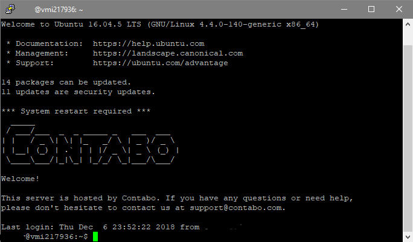

# helix Masternode VPS Installation

This masternode installation script vastly simplifies the setup of a helix masternode running on a virtual private server (VPS), and it also adds a number of other powerful features, including:

* IPv6 Support
* Installs 1-100 (or more!) helix masternodes in parallel on one VPS, with individual helix.conf and data directories
* It can install masternodes for other coins on the same VPS as helix
* 100% auto-compilation and 99% of configuration on the masternode side of things
* Automatically compiling from the latest helix release tag, or another tag can be specified
* Some security hardening is done, including firewalling and a separate user, increasing security
* Automatic startup for all masternode daemons

Some notes and requirements:

* Script has only been tested on a Contabo VPS, but should work almost anywhere where IPv6 addresses are available
* Currently only Ubunto 16.04 Linux is supported
* This script needs to run as root or with sudo, the masternodes will and should not!

This project was forked from https://github.com/masternodes/vps. @marsmensch (Florian) is the primary author behind this VPS installation script for masternodes. If you would like to donate to him, you can use the BTC address below

**Have fun, this is crypto after all!**

```
BTC  33ENWZ9RCYBG7nv6ac8KxBUSuQX64Hx3x3
```

# Install guide on Contabo

## How to get VPS server

For new masternode owners, **Contabo** is recommended as a VPS hosting provider, but other providers that allow direct root SSH login access and offer Ubunto 16.04 may work.

You can use the following  link to sign up with Contabo for VPS hosting:

https://contabo.com/?show=vps

## Deploy a new system

First, create a new VPS by selecting one of the VPS offers.

## VPS size

The 200 GB SSD / 8GB Memory instance is enough for 10-16 masternodes. You may need more memory as the helix blockchain grows over time, or if you want to run more masternodes.


Select Ubuntu 16.04.


## Select your payment period

Select for how many months you want to rent the VPS. Keep in mind that the longer the renting period is, the more discount you get.


## Installation of VNC viewer
Install VNC viewer while the server is being set up. You can download VNC viewer from here: https://www.realvnc.com/en/connect/download/viewer/.

Once VNC viewer is installed, return to the Contabo login details email to get the login details.

## Accessing your VPS via VNC viewer

Copy your password VNC access from the email details page.


Now open VNC viewer to add the server.


Enter the IP address in the VNC server field, and enter the server name you wish to use for this VPS (e.g., MN01) to Saved Sessions. Click ok.


Double click the server icon to start the VNC connection

Now enter your server login details provided in your Contabo email.
You cannot Ctrl+V to paste in the console.

User: root
Password: (paste or type password)

When you paste it will not display, so don't try to paste again.
Just paste once and press Enter.

## Install Putty

If copy paste doesn't work for you, you might have to install putty.

You can find the latest version of Putty here:
https://www.chiark.greenend.org.uk/~sgtatham/putty/latest.html

After you downloaded and installed Putty, go back to your VNC viewer and type:

```
sudo apt-get install ssh
```

After install ssh on your vps, move back to Putty.


Enter the IP address in the Host Name field, and enter the server name you wish to use for this VPS (e.g., VPS01) to Saved Sessions. Click save.

Click the open button. When the console has opened, click Yes in the PuTTY Security Alert box. 


## Install Masternode

Login to your newly installed node as "root".



Update your vps:
```
sudo apt-get update
sudo apt-get upgrade
```

Install these dependency:
```
sudo apt-get install jp2a git
```

Enter this command to copy the Masternode installation script and install a single helix Masternode:

(the git clone only has to be done 1 time ever on the vps)
```
git clone https://github.com/ProjectHelixCoin/vps.git 
```
```
cd ~/vps && ./install.sh -p helix
```

If you have your masternode private key, please use this (you can generate masternode private key with Step 2 below).

(the git clone only has to be done 1 time ever on the vps)
```
git clone https://github.com/ProjectHelixCoin/vps.git 
```
```
cd ~/vps && ./install.sh -p helix -k **PRIVATE KEY**
```
Using this command, you can skip "Configure masternode configuration files" below, because the command above adds the masternode private key to the masternode configuration files.

This prepares the system and installs the helix Masternode daemon. This includes downloading the latest helix masternode release, creating a swap file, configuring the firewall, and compiling the helix Masternode from source code. This process takes about 15-20 minutes.

### More complex situations (ignore if you are installing a single masternode on a new VPS)

If you wish to install more than one masternode on the same VPS, you can add a -c parameter to tell the script how many to configure, so for example this would install three helix masternodes (all entered on one line):

(the git clone only has to be done 1 time ever on the vps)
```
git clone https://github.com/ProjectHelixCoin/vps.git 
```
```
cd ~/vps && ./install.sh -p helix -c 3
```

If you already have your masternode private keys, you can add them as shown below (all entered on one line):

(the git clone only has to be done 1 time ever on the vps)
```
git clone https://github.com/ProjectHelixCoin/vps.git
```
```
cd ~/vps && ./install.sh -p helix -c 3 --key **PRIVATE KEY 01** --key2 **PRIVATE KEY 02** --key3 **PRIVATE KEY 03**
```
Using this command, you can skip the step for "Configure masternode configuration files", because the command above adds the masternode private keys to the masternode configuration files.


If you are upgrading your masternode(s) to a new release, you should first remove the old version of the VPS script so that the new one you download is tagged with the latest version, and then you add a -u parameter to upgrade existing nodes:

```
rm -rf /root/
```
(the git clone only has to be done 1 time ever on the vps)
```
git clone https://github.com/ProjectHelixCoin/vps.git 
```
```
cd ~/vps && ./install.sh -p helix -u
```

The project is configured to use the latest official release of the helix masternode code, and we will update this project each time a new release is issued, but without downloading the latest version of this project and using the -u parameter, the script will not update an existing helix node that is already installed.

While that is underway, go back to your local desktop and open helix-qt.

## Configure helix Wallet
### Step1 - Create Collateral Transaction
Once the wallet is open on your local computer, generate a new receive address and label it however you want to identify your masternode rewards (e.g., helix-MN-1). This label will show up in your transactions each time you receive a block reward.

Click the Request payment button, and copy the address.


Now go to the Send tab, paste the copied address, and send *exactly* 10,000 HLIX to it in a single transaction. Wait for it to confirm on the blockchain. This is the collateral transaction that will be locked and paired with your new masternode. If you are setting up more than one masternode at one time, repeat this process for each one.


### Step 2 - Generate Masternode Private Key
Go to the **[Tools > Debug Console]** and enter these commands below:

```
masternode genkey
```
This will produce a masternode private key:


Copy this value to a text file. It will be needed for both the helix configuration file on the masternode VPS, and the masternode configuration file on the computer with the controlling helix wallet.

If you are setting up multiple masternodes, repeat this step for each one. Each time you run the masternode genkey command it will give you a new private key--it doesn't matter which one you use, but it is important that it is unique for each masternode and that the VPS helix configuration file and wallet masternode configuration file match (see below).

### Step 3 - Masternode Outputs

This will give you the rest of the information you need to configure your masternode in your helix wallet--the transaction ID and the output index.

```
masternode outputs
```


The long string of characters is the *Transaction ID* for your masternode collateral transaction. The number after the long string is the *Index*. Copy and paste these into the text file next to the private key you generated in Step 2.

If you have multiple masternodes in the same wallet and have done the 10,000 HLIX transactions for each of them, masternode outputs will display transaction IDs and indexes for each one. You can choose which private key to go with each transaction ID and index, as long as they are all different, and you make sure the corresponding lines in masternode.conf and the VPS helix configuration files match (see below).

## End of installations
When the script finishes, it will look similar to this:


You only have a few steps remaining to complete your masternode configuration.
## Configure masternode configuration files
Since this installation method supports multiple masternodes, the helix configuration files have a node number added to them (e.g., helix_n1.conf, helix_n2.conf), stored in the /etc/masternodes directory. If you have a single masternode on the VPS, you will only need to edit /etc/masternodes/helix_n1.conf.

To open helix_n1.conf for editing, enter these commands:
```
sudo apt-get install nano
nano /etc/masternodes/helix_n1.conf
```
The next step adds your masternode private key.

## Add masternode private key
What you need to change is only masternode private key.
(We recommend using IPv6 which is the default, but if you choose IPv4 when you ran the installation script, please edit #NEW_IPv4_ADDRESS_FOR_MASTERNODE_NUMBER to your VPS IP address).
After typing the nano command, you will see something similar to this.


Copy the masternode private key from the text file you saved it in, and replace HERE_GOES_YOUR_MASTERNODE_KEY_FOR_MASTERNODE_helix_1 with that private key (this typically begins with an 8).

While you have this file opened, copy the information that follows after masternodeaddr=, starting with the open bracket. This is the masternode's IPv6 address and port, and will be needed for the wallet's masternode.conf file.

Once you have your masternode private key entered, press <font color="Green">Ctrl+X</font> .
Then press <font color="Green">Y</font> to save, and press Enter to exit.

Finally, close and restart your helix wallet so that it will have the new masternode configuration.

## Start your masternodes
A script for starting all masternodes on the VPS has been created at /usr/local/bin/activate_masternodes_helix.sh.
Run this command after your masternode configuration written above.

```
sudo /usr/local/bin/activate_masternodes_helix
```

The masternode daemons will start and begin loading the helix blockchain.

## Finishing Wallet Configuration & Activate Masternode
To activate your nodes from your wallet, one of the last steps is to add a line for the masternode in the masternode.conf file. This file has the following format, with each value separated with a space:

* alias IP:Port masternodeprivatekey collateral_transaction_ID collateral_output_index
* alias - A short name you use to identify the masternode, you can choose this name as long as it is without spaces (e.g., helix-MN-1)
* IP:Port - The IP address (either IPv6 or IPv4) and the Port where the masternode is running, separated by a colon (:). You copied this from the helix.conf file on the VPS.
* collateral_transaction_ID: This is the transaction ID you copied from masternode outputs.
* collateral_output_index: This is the index you copied from masternode outputs.

From the wallet menu, edit the local wallet **masternode.conf** file. **[Tools > Open Masternode Configuration File]**
Add the MN conf line, like the example below to the masternode.conf file. Save it, and close the file. It will look like the following example, using your values for each of the fields above. A common mistake is mixing up the private key and the collateral transaction ID--to make this easier, the private key usually begins with an 8.

example.
```
helix-MN-1 [2001:19f0:5001:ca6:2085::1]:11771 88xrxxxxxxxxxxxxxxxxxxxxxxx7K 6b4c9xxxxxxxxxxxxxxxxxxxxxxxxxxxxxxxxxxxxxxx7ee23 0
```

The image below shows another example using an IPv4 IP address. If you followed this guide you are probably using an IPv6 address that looks like the line above.


If you are running multiple masternodes, you need to add one of these lines for each masternode, and make sure the private key on each line matches the corresponding private key you entered in the VPS helix configuration file for that masternode.
## Check syncing status of masternode
The masternode cannot complete activation until it is fully synced with the helix blockchain network.

To check the status of your masternode, please enter this command in the VPS terminal. If you have multiple masternodes on the same VPS, you can change n1 to n2 etc. below to check the status of each one.

```
/usr/local/bin/helix-cli -conf=/etc/masternodes/helix_n1.conf getinfo
```
The output will look like this:
```
{
  "version": 1010000,
  "protocolversion": 7002,
  "walletversion": 61000,
  "balance": 0.00000000,
  "privatesend_balance": 0.00000000,
  "blocks": 176209,
  "timeoffset": 0,
  "connections": 44,
  "proxy": "",
  "difficulty": 42882.54964804553,
  "testnet": false,
  "moneysupply" : 11814171.53907114,
  "zHLIXsupply" : {
      "1" : 263.00000000,
      "5" : 135.00000000,
      "10" : 500.00000000,
      "50" : 700.00000000,
      "100" : 1300.00000000,
      "500" : 5000.00000000,
      "1000" : 11000.00000000,
      "5000" : 90000.00000000,
      "total" : 108898.00000000
  },
  "keypoololdest" : 1507302593,
  "keypoolsize" : 1001,
  "paytxfee" : 0.00000000,
  "relayfee" : 0.00010000,
  "staking status" : "Staking Not Active",
  "errors" : ""
}
```

We're looking at the *blocks*, and need that to be the latest block in the blockchain. You can check your local wallet to see the latest block by hovering over the green check mark.


Once your masternode has synced up to the latest block, go to next step. The syncing process may take 15-30 minutes or more as the helix blockchain grows. You can keep checking progress with the command above, by pressing the up arrow and Enter to repeat it.

## Start Masternode

Go to the debug console of your helix wallet **[Tools->Debug Console]** and enter the following command, replacing **mn-alias** with the name of the masternode in the Alias column of the Masternodes tab:

```
startmasternode alias false mn-alias
```

You may need to unlock the wallet **[Settings->Unlock Wallet]** before you run this command, entering your passphrase. You can lock the wallet after it is finished.

If everything was setup correctly, after entering the command you will see something like this:
```
{
"overall" : "Successfully started 1 masternodes, failed to start 0, total 1",
"detail" : {
"status" : {
"alias" : "helix-mn01",
"result" : "successful"
}
```
If you are setting up multiple masternodes, repeat this for each one. You can now close the debug console, return the Masternodes tab and check the status:


It should say ENABLED, and within an hour, the timer in the Active column should start increasing.

Your helix masternode is now set up and running! Depending on how many masternodes there are, it may take 12-24 hours before you see your first masternode reward--this is normal and rewards should come at more regular intervals after the first one.


## Issues and Questions
Please open a GitHub Issue if there are problems with this installation method. Many helix team members actively support people installing masternodes and can provide assistance in the helix Discord channel.
Here is a Discord invitation:

https://discord.gg/dVgcEka

If you would like to make a donation to helix's ongoing development, you can send helix to the core team at this address: HDw5WYmcSePwTxRZcDfzWmZnG3KNdtktgB
